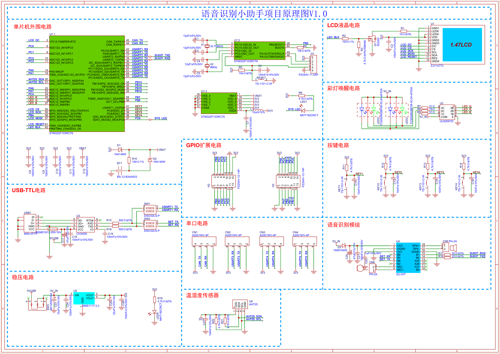
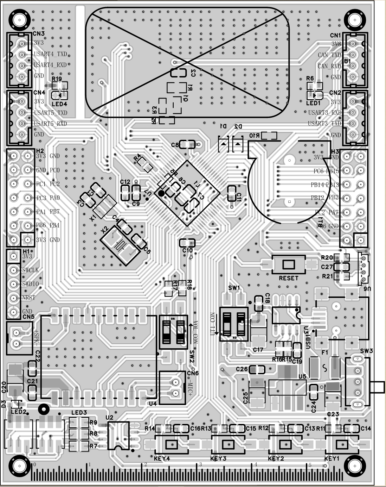
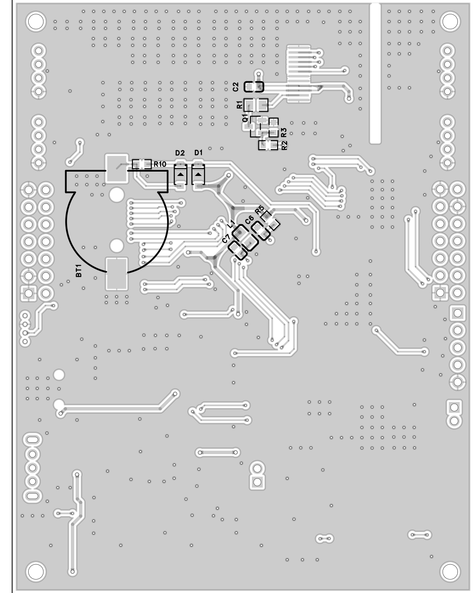
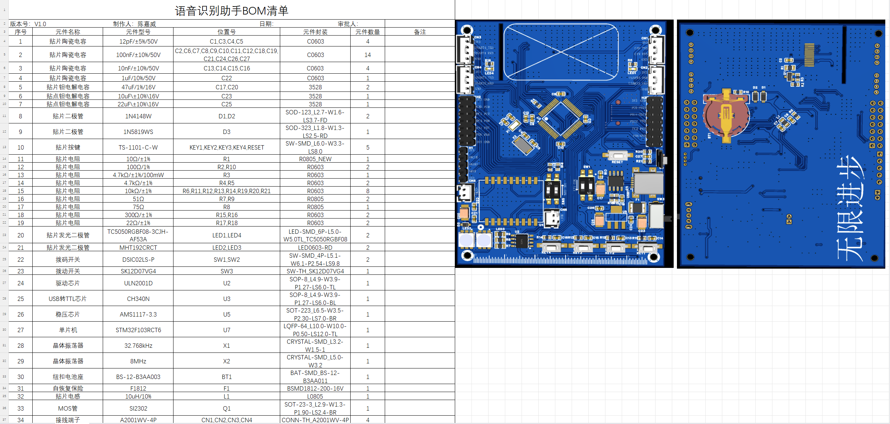
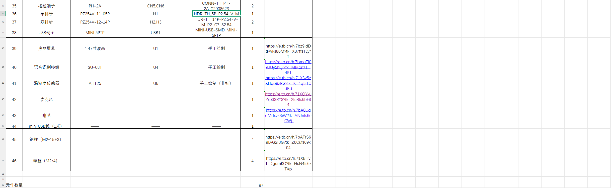

# Voice-Recognition-Assistant语音识别助手

# 项目介绍

本项目是一款基于**STM32F103RTC6** 微控制器的低成本语音识别控制助手,核心功能是通过语音指令实现对外部设备(如 LED 灯、继电器、小型家电)的开关控制,同时支持语音唤醒、指令反馈等基础交互。项目定位为 “入门级开源硬件 + 软件方案”,适合电子爱好者、嵌入式开发初学者学习语音识别技术、MCU 外设控制及 PCB 设计,支持二次开发扩展(如新增指令、接入更多执行设备)。

# 项目设计需求

### 1. 功能需求

* 支持自定义语音唤醒词(默认唤醒词:“小助手”);
* 可识别至少 8 条基础控制指令(如 “打开 LED”“关闭继电器”“查询状态” 等);
* 执行指令后提供可视化反馈(LED 灯亮灭 / 闪烁);
* 支持离线语音识别(无需联网,依赖本地语音识别芯片)。

### 2. 性能需求

* 语音唤醒距离:1-3 米(安静环境下);
* 指令识别准确率:≥90%(标准普通话、无强噪音场景);
* 指令响应延迟:≤1 秒(从指令说完到执行动作);
* 工作电压:5V DC(USB 供电)。

### 3. 硬件需求

* 核心控制:需支持 GPIO、SPI/I2C 通信,主频≥72MHz;
* 语音识别:选用低成本离线语音芯片(SU-07T),支持中文指令识别;
* 执行外设:预留 LED、继电器接口,支持高低电平控制;
* 电源:支持 5V 输入,具备过流保护(可选)。

### 4. 软件需求

* 开发环境:Keil MDK 5.37 或 STM32CubeIDE;
* 依赖库:STM32 标准外设库(STM32F1xx\_StdPeriph\_Lib)、SU-07T语音识别驱动库;
* 固件支持:支持通过 USB-TTL 模块烧录,支持指令自定义配置。

# 功能特点

1. **低成本易复现:** 核心元器件总价≤100 元,PCB 设计为双层板,焊接难度低,适合新手;
2. **离线高可靠:** 基于 LD3320 离线语音芯片,无需联网,避免网络延迟或断网失效;
3. **指令可扩展:** 代码中预留 “指令配置表”,可通过修改宏定义新增 / 删除语音指令(无需修改核心逻辑);
4. **可视化反馈:** 板载 2 颗 LED(电源灯 + 状态灯),指令执行成功 / 失败对应不同闪烁频率;
5. **供电灵活:** 支持 USB-Type-C 5V 供电(电脑 / 充电宝) + 升压模块供电,适配多场景。

# 原理图

## 核心模块连接关系

|模块|核心元器件|与 STM32 引脚连接(示例)|通信方式|
| ------------------| --------------------| -----------------------------------------------------------------| -----------|
|语音识别模块|SU-07T|PA5(SPI\_SCK)、PA6(SPI\_MISO)、PA7(SPI\_MOSI)、PB0(CS)|SPI|
|执行模块(LED)|LED+220Ω 限流电阻|PB12(LED1)、PB13(LED2)|GPIO 输出|
|执行模块(继电器)|5V 继电器模块|PB14 (继电器控制端)|GPIO 输出|
|电源模块|AMS1117-3.3V|VIN (5V)→3.3V 输出至 STM32|线性稳压|

## 原理图说明

* 语音识别模块:SU-07T的 CS 引脚(片选)接 PB0,复位引脚(RST)接 PB1,低电平复位;
* 执行模块:LED 采用共阴极设计,STM32 引脚输出高电平时 LED 点亮;继电器需搭配 NPN 三极管驱动(避免 MCU 引脚过流);
* 电源模块:5V 输入经 AMS1117-3.3V 稳压后给 STM32 和 LD3320 供电,板载 1000μF 电容滤除电源纹波

​​

# 硬件设计

## 1. PCB 位号图(顶层)

|区域|主要元器件布局|作用|
| ------------| ----------------------------------| -------------------------------|
|核心控制区|U1(STM32F103RCT6)、U2(SU-07T)|MCU 与语音识别芯片,核心运算区|
|外设接口区|J1 (USB-Type-C)、J2 (继电器接口)|供电接口与外部设备连接接口|
|反馈区|D1 (电源 LED)、D2 (状态 LED)|直观显示设备工作状态|

​​

## 2. PCB 位号图(底层)

|区域|主要元器件布局|作用|
| ------------| ---------------------------------| -------------------------------------------|
|电源电路区|U3 (AMS1117-3.3V)、C1-C6 (电容)|稳压与滤波,保证供电稳定|
|驱动电路区|Q1 (NPN 三极管)、R7 (限流电阻)|继电器驱动电路,保护 MCU 引脚|
|过孔区|VIA1-VIA5 (过孔)|顶层与底层信号互联(如 SPI 信号线、电源地)|

​​

## 过孔区

​​

# 硬件组成

## BOM表单

​​

​​

‍

# 软件逻辑

略

‍

# 使用说明

## 1. 硬件搭建步骤

1. 按 BOM 清单采购元器件,通过立创 EDA 或 Altium Designer 导入 PCB 文件打样;
2. 焊接顺序:先焊被动元器件(电阻、电容)→ 再焊芯片(STM32、SU-07T、AMS1117)→ 最后焊接口(USB、端子座);
3. 焊接完成后,用万用表检测电源引脚(VCC-GND)是否短路,确认无误后接入 5V 电源(电源 LED 点亮表示供电正常)。

## 2. 软件烧录步骤

1. 安装开发环境:STM32CubeIDE 或 Keil MDK 5,导入项目源码(`Software`​ 文件夹下);
2. 连接烧录工具:将 USB-TTL 模块(如 CH340)与 STM32 的 SWD 引脚(SWDIO-SWCLK-GND-VCC)连接;
3. 编译与烧录:在 IDE 中编译项目生成 `.hex`​ 文件,使用 STM32CubeProgrammer 或 FlyMcu 工具将固件烧录到 STM32 中。

## 3. 功能测试步骤

1. 唤醒测试:通电后,距离设备 1-3 米说 “小助手”,状态 LED 亮 1 秒表示唤醒成功;
2. 指令测试:唤醒后说 “打开 LED”,LED1 点亮且状态 LED 闪 1 次(执行成功);说 “关闭 LED”,LED1 熄灭;
3. 故障排查:若唤醒无反应,检查 SU-07T 接线(SPI 引脚、复位引脚);若指令不执行,检查 GPIO 与执行模块的接线。

# 开源补充说明

## 1. 项目结构	

```plaintext
Voice-Recognition-Assistant/
├─ Hardware/          # 硬件设计文件(原理图、PCB文件、BOM清单)
├─ Software/          # 软件源码(各模块代码、头文件、固件)
├─ Docs/              # 文档(使用手册、原理图PDF、测试报告)
├─ LICENSE            # 开源许可证(MIT License)
└─ README.md          # 项目首页说明(含功能简介、快速上手链接)
```

## 2. 贡献指南

* 若需新增功能(如支持蓝牙语音、增加指令数量),可 Fork 本项目后提交 Pull Request(PR),PR 需包含功能说明、代码修改记录及测试结果;
* 遇到问题可在 Issues 中提交,需描述问题场景(如 “唤醒无反应,已检查接线”)及硬件 / 软件版本。

## 3. 许可证

本项目采用**MIT License**开源,允许个人或企业自由使用、修改、二次开发,无需授权,但需保留原项目的版权声明。

‍
